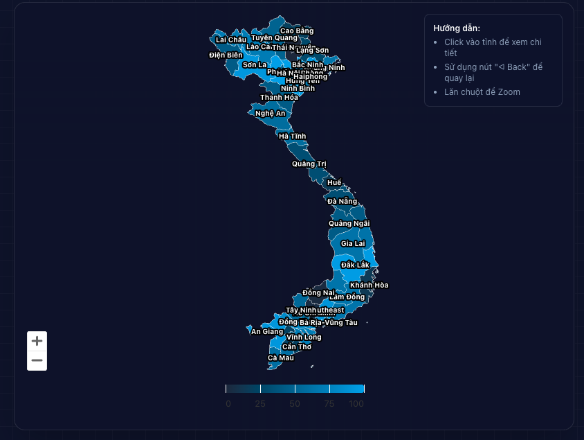
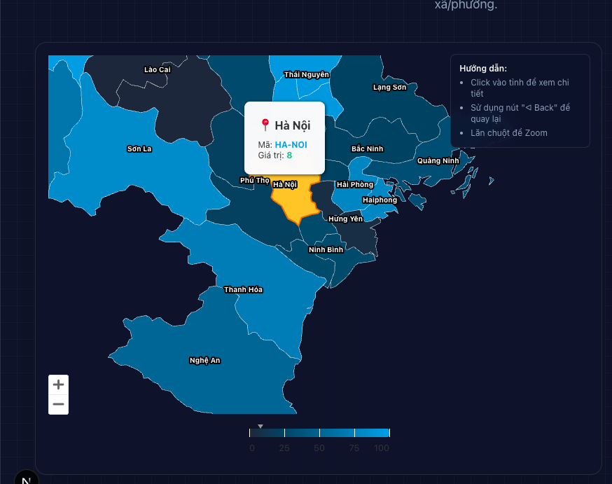
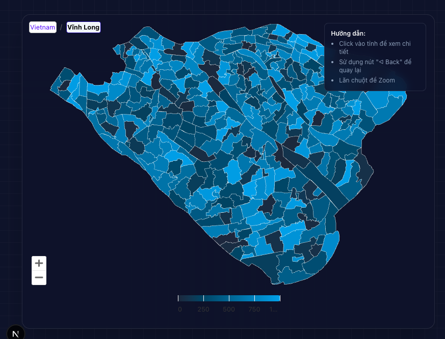

# Vietnam Map - 34 Provinces


[](https://www.npmjs.com/package/@xdev-asia/vietnam-map-34-provinces)
[](https://opensource.org/licenses/MIT)
[](https://xdev-asia-labs.github.io/vietnam-map-34-provinces/)

Interactive map component hiển thị bản đồ Việt Nam với **34 tỉnh/thành phố** và **3,321 xã/phường** theo cấu trúc hành chính mới (QĐ 19/2025/QĐ-TTg, hiệu lực 01/07/2025).

**🔗 [Live Demo](https://xdev-asia-labs.github.io/vietnam-map-34-provinces/)** | **📖 [Documentation](https://xdev-asia-labs.github.io/vietnam-map-34-provinces/docs/vanilla.html)**

## 🖼️ Showcase

| Bản đồ tổng quan | Drilldown cấp xã | Tùy chọn màu sắc |
|:---:|:---:|:---:|
|  |  |  |

## ✨ Highlights

- 🗺️ **34 tỉnh/TP mới** (6 TP trực thuộc TW + 28 tỉnh)
- 📍 **3,321 xã/phường** với mã BNV + TMS chính thức
- 🔄 **2 cấp hành chính**: Tỉnh → Xã (bỏ cấp Huyện)
- 🎯 **Framework-agnostic**: Vanilla JS, React, Vue, Angular
- 📦 **TypeScript** full support

## 📦 Installation

```bash
npm install @xdev-asia/vietnam-map-34-provinces highcharts
```

## 🚀 Quick Start

### Vanilla JavaScript

```javascript
import { createVietnamMap } from '@xdev-asia/vietnam-map-34-provinces/vanilla';

const map = createVietnamMap('#container', {
  height: 600,
  onProvinceClick: (province) => console.log('Clicked:', province.name)
});
```

### React

```tsx
import { VietnamMap } from '@xdev-asia/vietnam-map-34-provinces/react';

function App() {
  return (
    <VietnamMap
      height={600}
      showLabels={true}
      showZoomControls={true}
      enableDrilldown={true}
      hoverColor="#fbbf24"
      colorAxis={{
        minColor: "#1e293b",
        maxColor: "#0ea5e9"
      }}
      tooltipFormatter={(point) => `
        <div style="padding: 8px;">
          <b>${point.name}</b><br/>
          Value: ${point.value}
        </div>
      `}
      onProvinceClick={(province) => {
        console.log('Clicked:', province.name);
      }}
    />
  );
}
```

#### React Props

| Prop | Type | Default | Description |
|------|------|---------|-------------|
| `height` | `number \| string` | `600` | Chiều cao bản đồ |
| `showLabels` | `boolean` | `true` | Hiển thị tên tỉnh |
| `showZoomControls` | `boolean` | `true` | Hiển thị nút zoom (+/-) |
| `enableDrilldown` | `boolean` | `true` | Cho phép click để xem cấp xã |
| `hoverColor` | `string` | `#fbbf24` | Màu khi hover |
| `borderColor` | `string` | `#ffffff` | Màu viền tỉnh |
| `colorAxis` | `object` | - | Cấu hình gradient màu |
| `tooltipFormatter` | `(point) => string` | - | Custom HTML tooltip |
| `onProvinceClick` | `(province) => void` | - | Callback khi click tỉnh |
| `data` | `array` | - | Dữ liệu tùy chỉnh |
| `className` | `string` | - | CSS class cho container |
| `options` | `Highcharts.Options` | - | Override Highcharts config |

## 🛠️ Core API

Tra cứu dữ liệu tỉnh/xã với bất kỳ framework nào:

```javascript
import { 
  // Province utilities
  NEW_34_PROVINCES,
  getProvinceByName,
  getNewProvinceName,
  getProvinceByCode,
  
  // Commune utilities  
  getProvinceCommunes,
  getProvinceData,
  searchCommunes,
  getProvinceStats,
  
  // Lookup tables
  OLD_TO_NEW_PROVINCE_MAP,
  TMS_CODE_TO_PROVINCE
} from '@xdev-asia/vietnam-map-34-provinces/core';

// Get all communes in a province
const communes = getProvinceCommunes('Hà Nội');
console.log(communes.length); // 126

// Search communes by name
const results = searchCommunes('Ba Đình');
// [{ province: 'Hà Nội', commune: { code: 10101003, name: 'Phường Ba Đình' } }]

// Get province by TMS code (for tax systems)
const province = getProvinceByTMSCode(101); // Hà Nội

// Convert old province name to new
getNewProvinceName('Hà Giang'); // → "Tuyên Quang"
getNewProvinceName('Bình Dương'); // → "Hồ Chí Minh"

// Statistics
console.log(getProvinceStats());
// {
//   totalProvinces: 34,
//   totalCommunes: 3321,
//   cities: 6,
//   provinces: 28,
//   largestProvince: { name: 'Hồ Chí Minh', commune_count: 168 },
//   smallestProvince: { name: 'Lai Châu', commune_count: 38 }
// }
```

## 📊 34 Tỉnh/Thành Phố

### 6 Thành phố trực thuộc Trung ương

| # | Tên | Xã/Phường | Hợp nhất từ |
|---|-----|-----------|-------------|
| 1 | Hà Nội | 126 | Hà Nội + Hà Tây |
| 4 | Hải Phòng | 114 | Hải Phòng + Hải Dương |
| 20 | Huế | 40 | Thừa Thiên Huế |
| 21 | Đà Nẵng | 94 | Đà Nẵng + Quảng Nam |
| 29 | Hồ Chí Minh | 168 | HCM + Bình Dương + Bà Rịa-VT |
| 33 | Cần Thơ | 103 | Cần Thơ + Hậu Giang + Sóc Trăng |

### 28 Tỉnh

| # | Tên | Xã | Hợp nhất từ |
|---|-----|-----|-------------|
| 2 | Bắc Ninh | 99 | Bắc Ninh + Bắc Giang |
| 3 | Quảng Ninh | 54 | - |
| 5 | Hưng Yên | 104 | Hưng Yên + Thái Bình |
| 6 | Ninh Bình | 129 | Ninh Bình + Nam Định + Hà Nam |
| 7 | Cao Bằng | 56 | - |
| 8 | Tuyên Quang | 124 | Tuyên Quang + Hà Giang |
| 9 | Lào Cai | 99 | Lào Cai + Yên Bái |
| 10 | Thái Nguyên | 92 | Thái Nguyên + Bắc Kạn |
| 11 | Lạng Sơn | 65 | - |
| 12 | Phú Thọ | 148 | Phú Thọ + Vĩnh Phúc + Hòa Bình |
| 13 | Điện Biên | 45 | - |
| 14 | Lai Châu | 38 | - |
| 15 | Sơn La | 75 | - |
| 16 | Thanh Hóa | 166 | - |
| 17 | Nghệ An | 130 | - |
| 18 | Hà Tĩnh | 69 | - |
| 19 | Quảng Trị | 78 | Quảng Trị + Quảng Bình |
| 22 | Quảng Ngãi | 96 | Quảng Ngãi + Kon Tum |
| 23 | Khánh Hòa | 65 | Khánh Hòa + Ninh Thuận |
| 24 | Gia Lai | 135 | Gia Lai + Bình Định |
| 25 | Đắk Lắk | 102 | Đắk Lắk + Phú Yên |
| 26 | Lâm Đồng | 124 | Lâm Đồng + Đắk Nông + Bình Thuận |
| 27 | Tây Ninh | 96 | Tây Ninh + Long An |
| 28 | Đồng Nai | 95 | Đồng Nai + Bình Phước |
| 30 | Vĩnh Long | 124 | Vĩnh Long + Bến Tre + Trà Vinh |
| 31 | Đồng Tháp | 102 | Đồng Tháp + Tiền Giang |
| 32 | An Giang | 102 | An Giang + Kiên Giang |
| 34 | Cà Mau | 64 | Cà Mau + Bạc Liêu |

## 📖 Documentation

- [Vanilla JS Guide](https://xdev-asia-labs.github.io/vietnam-map-34-provinces/docs/vanilla.html)
- [React Guide](https://xdev-asia-labs.github.io/vietnam-map-34-provinces/docs/reactjs.html)
- [Vue 3 Guide](https://xdev-asia-labs.github.io/vietnam-map-34-provinces/docs/vuejs.html)
- [Angular Guide](https://xdev-asia-labs.github.io/vietnam-map-34-provinces/docs/angular.html)

## 📝 License

MIT

## 📚 Data Sources

- [QĐ 19/2025/QĐ-TTg](https://chinhphu.vn) - Bảng danh mục mã số ĐVHC
- [phucanhle/vn-xaphuong-2025](https://github.com/phucanhle/vn-xaphuong-2025) - JSON data
- [Highcharts Maps](https://www.highcharts.com/docs/maps/getting-started)

---

Made with ❤️ by [xdev-asia-labs](https://github.com/xdev-asia-labs)
